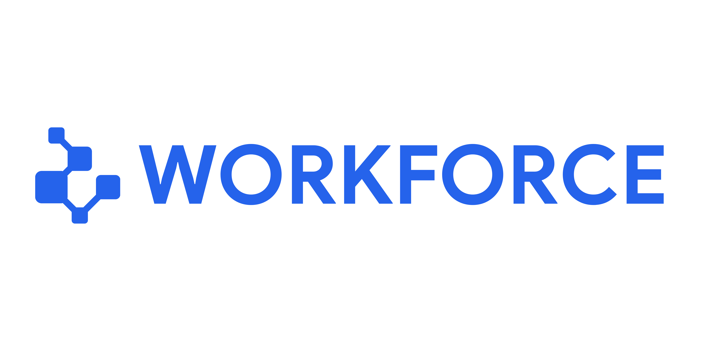

<p align="center">
  
</p>

<p align="center">
  <strong>Open-source AI-powered workforce management platform.</strong><br/>
  Build, manage, and scale your team with intelligent agents — all in one place.
</p>

<p align="center">
  <a href="https://github.com/your-org/workforce/blob/main/LICENSE"></a>
  <a href="https://github.com/your-org/workforce/issues"></a>
  <a href="https://github.com/your-org/workforce/stargazers"></a>
  <a href="CONTRIBUTING.md"></a>
</p>

---

## About

Workforce is an open-source platform that combines workforce management with AI-powered agents. It provides a modern console for managing instructions, libraries, connections, memories, and agents — with a built-in chat interface powered by Google Gemini.

Whether you're building internal tools, managing teams, or experimenting with AI agents, Workforce gives you the foundation to move fast.

## Features

- **AI Chat** — Built-in chat panel powered by Gemini API with conversation history
- **Agent Framework** — Extensible architecture for building and managing AI agents
- **Console Dashboard** — Full admin console with sidebar navigation, settings, and profile management
- **Dark/Light Mode** — System-aware theme switching with manual toggle
- **Authentication Ready** — Login, signup, forgot/reset password pages
- **Responsive UI** — Mobile-friendly design with collapsible sidebar
- **Component Library** — 17+ reusable UI components (shadcn/ui pattern)
- **Type Safe** — Full TypeScript coverage across the codebase

## Tech Stack

| Layer | Technology |
|-------|-----------|
| Framework | Next.js 14 (App Router) |
| Language | TypeScript |
| Styling | Tailwind CSS + CSS Variables |
| UI | shadcn/ui (Radix primitives) |
| AI | Google Gemini (`@google/generative-ai`) |
| Animations | Framer Motion |
| Icons | Lucide React |
| Font | Google Sans |
| Theme | next-themes |

## Quick Start

```bash
# Clone the repo
git clone https://github.com/your-org/workforce.git
cd workforce

# Install dependencies
npm install

# Set up environment
cp .env.example .env.local
# Add your GEMINI_API_KEY to .env.local

# Run development server
npm run dev
```

Open [http://localhost:3000](http://localhost:3000) to see the site, or navigate to `/console` for the dashboard.

## Environment Variables

| Variable | Description | Required |
|----------|-------------|----------|
| `GEMINI_API_KEY` | Google Gemini API key | Yes (for chat) |
| `GEMINI_MODEL` | Gemini model name | No (defaults to `gemini-1.5-flash`) |
| `NEXT_PUBLIC_APP_URL` | App URL | No |
| `DATABASE_URL` | Database connection string | No (future) |

See [`.env.example`](.env.example) for the full list.

## Project Structure

```
src/
├── app/
│   ├── api/ai/            # AI API routes (Gemini chat)
│   ├── console/           # Console pages (overview, agents, settings, etc.)
│   ├── site/              # Public site pages (home)
│   ├── auth/              # Auth pages (login, signup, forgot, reset)
│   └── legal/             # Legal pages (terms, privacy, cookies)
├── components/
│   ├── console/           # Console components (layout, sidebar, header, chat, profile)
│   │   ├── chat/          # Chat system (messages, input, file preview)
│   │   └── settings/      # Settings sidebar
│   ├── app/               # Public site components (header, footer, home sections)
│   ├── shared/            # Shared components (theme provider, toggle, cookie banner)
│   ├── hooks/             # Custom hooks (autosize textarea)
│   └── ui/                # Reusable UI primitives (17+ components)
├── lib/
│   ├── ai/                # AI client (Gemini initialization)
│   └── utils.ts           # Utility functions
```

## Console Pages

| Route | Description |
|-------|-------------|
| `/console` | Redirects to overview |
| `/console/overview` | Dashboard overview |
| `/console/instructions` | Manage agent instructions |
| `/console/libraries` | Knowledge libraries |
| `/console/connections` | External connections |
| `/console/memories` | Agent memories |
| `/console/agents` | Agent management |
| `/console/settings` | Profile, security, preferences |
| `/console/help` | Help & documentation |

## Scripts

| Command | Description |
|---------|-------------|
| `npm run dev` | Start development server |
| `npm run build` | Build for production |
| `npm run start` | Start production server |
| `npm run lint` | Run ESLint |

## Contributing

We welcome contributions! Please read our [Contributing Guide](CONTRIBUTING.md) to get started.

1. Fork the repository
2. Create your branch (`git checkout -b feature/amazing-feature`)
3. Commit your changes (`git commit -m 'feat: add amazing feature'`)
4. Push to the branch (`git push origin feature/amazing-feature`)
5. Open a Pull Request

Please read our [Code of Conduct](CODE_OF_CONDUCT.md) before contributing.

## Roadmap

See [ROADMAP.md](ROADMAP.md) for planned features including:

- User authentication & RBAC
- Agent development kit (ADK)
- Real-time collaboration
- Plugin system
- Mobile app

## Security

Found a vulnerability? Please report it responsibly. See [SECURITY.md](SECURITY.md) for details.

## License

This project is licensed under the **MIT License** — see the [LICENSE](LICENSE) file for details.

## Changelog

See [CHANGELOG.md](CHANGELOG.md) for release history.

---

<p align="center">
  Made with ❤️ by the Workforce community
</p>
